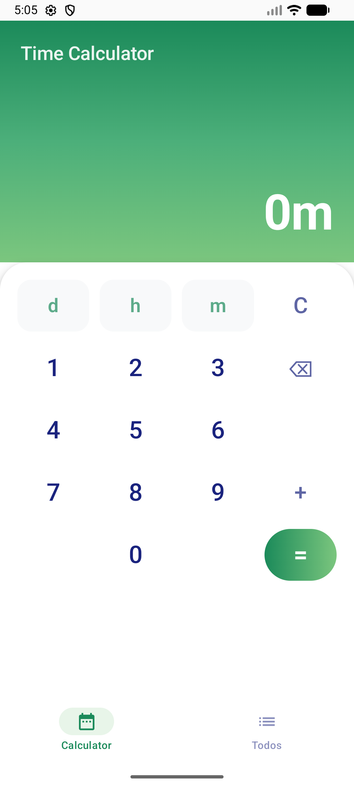
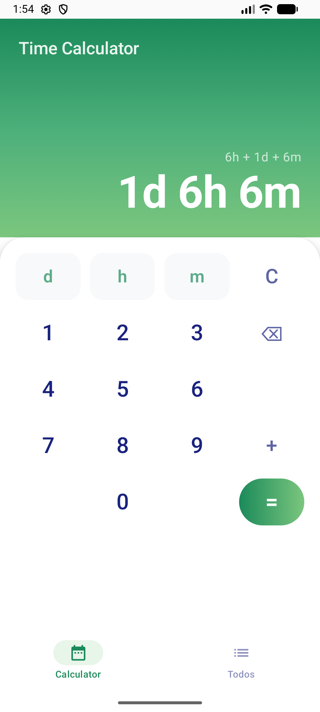
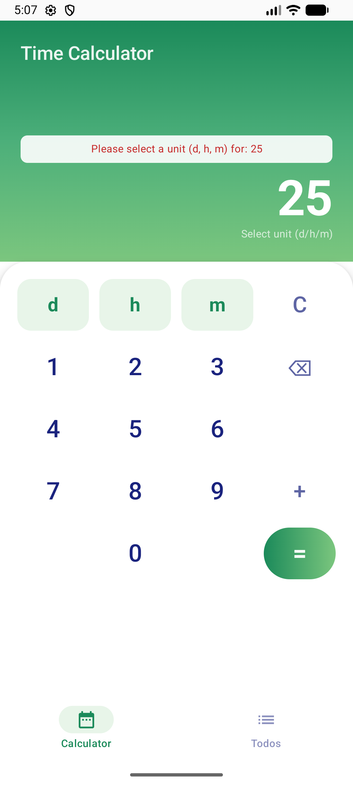
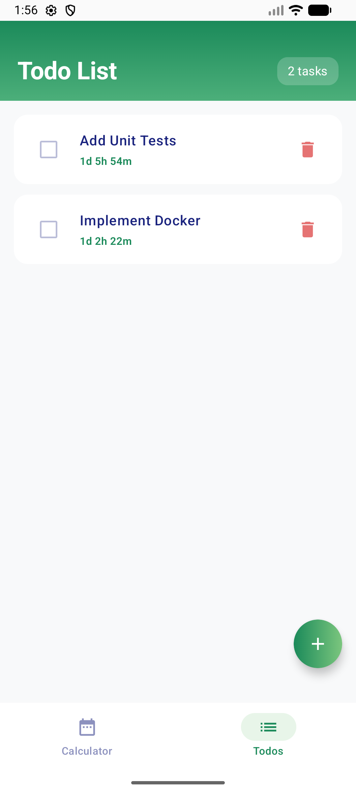
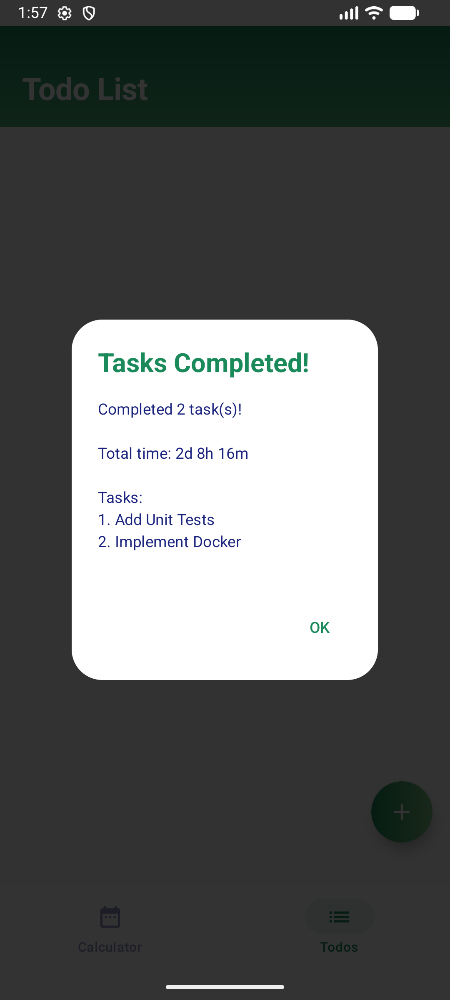

# Time Calculator App

An Android app for calculating durations and managing timed todos. Built with Jetpack Compose.

## Features

- **Time Calculator**: Add durations in days, hours, and minutes
- **Todo List**: Create todos with time estimates, finish selected tasks to see total time
- **Input Validation**: Prevents invalid input (digits without units)

## Screenshots

| Calculator | Calculation Result | Validation |
|:---:|:---:|:---:|
|  |  |  |

| Todo List | Tasks Completed |
|:---:|:---:|
|  |  |

## Tech Stack

- Kotlin
- Jetpack Compose
- Material 3
- Navigation Compose
- ViewModel + StateFlow

